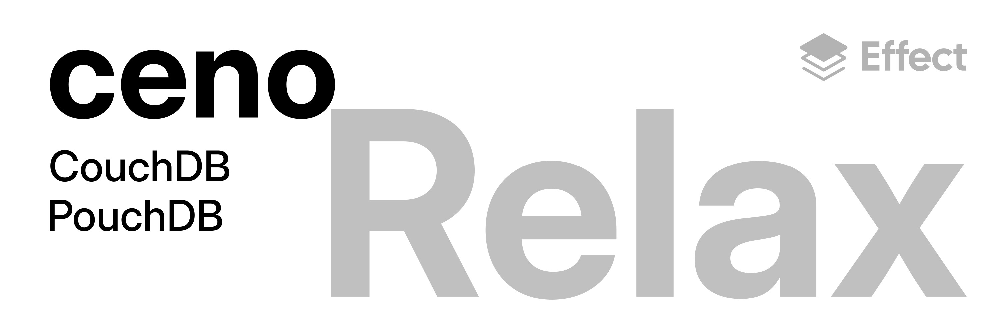

<p align="center">
  
</p>

# ceno

类型安全的 [CouchDB](https://couchdb.apache.org/) 客户端，基于 [Effect](https://effect.website) 构建。

特性：

- **类型安全** — 每个响应、参数和错误都通过 Effect Schema 静态类型化。
- **Effect 原生** — 基于 `Effect.gen`、Service 和 Layer 构建，与整个 Effect 生态系统无缝组合。
- **后端无关** — 服务契约定义在 `@ceno/core` 中；`@ceno/couchdb` 是其中一种实现。未来的 PouchDB 后端将实现相同的接口。
- **传输层无关** — 不捆绑任何 `HttpClient`。由你自行提供传输层（`FetchHttpClient`、`NodeHttpClient` 等）。
- **可精确捕获的错误** — CouchDB 错误码映射为标签化错误类（`CenoNotFound`、`CenoConflict`……），支持精确的 `catchTag` 处理。

## 安装

```bash
npm install @ceno/core @ceno/couchdb effect
```

## 快速开始

```typescript
import { Database, Document, Server } from "@ceno/core";
import { CouchDbClient, layer } from "@ceno/couchdb";
import { Effect, Redacted } from "effect";
import { FetchHttpClient } from "effect/unstable/http";

const program = Effect.gen(function* () {
  const server = yield* Server;
  const database = yield* Database;
  const document = yield* Document;

  const info = yield* server.info;
  console.log(`CouchDB ${info.version}`);

  yield* database.create("alice");
  const response = yield* document.put("alice", "rabbit", { happy: true });
});

program.pipe(
  Effect.provide(layer),
  Effect.provide(
    CouchDbClient.layer({
      url: "http://localhost:5984",
      username: "admin",
      password: Redacted.make("password"),
    }),
  ),
  Effect.provide(FetchHttpClient.layer),
  Effect.runPromise,
);
```

## 包

| 包                                    | 说明                                                                 |
| ------------------------------------- | -------------------------------------------------------------------- |
| [`@ceno/core`](./packages/core)       | 后端无关的服务契约、Schema 和错误类型                                |
| [`@ceno/schema`](./packages/schema)   | 基于 `@ceno/core` 的 Schema 感知、带版本迁移的文档操作               |
| [`@ceno/couchdb`](./packages/couchdb) | CouchDB HTTP 实现——**[完整 API 文档](./packages/couchdb/README.md)** |

## 示例

[`examples/`](./examples) 目录包含可运行的示例，由浅入深地展示 ceno 的功能：

| 示例                                                    | 内容                                     |
| ------------------------------------------------------- | ---------------------------------------- |
| [`01-server-info`](./examples/01-server-info)           | 连接服务器并查询元数据                   |
| [`02-database-basics`](./examples/02-database-basics)   | 数据库生命周期：创建、存在性、信息、列表 |
| [`03-document-crud`](./examples/03-document-crud)       | 文档增删改查及 `.in(db)` 数据库作用域    |
| [`04-bulk-operations`](./examples/04-bulk-operations)   | 批量写入与批量获取                       |
| [`05-mango-queries`](./examples/05-mango-queries)       | Mango 查询与索引                         |
| [`06-design-documents`](./examples/06-design-documents) | MapReduce 视图与设计文档信息             |
| [`07-changes-feed`](./examples/07-changes-feed)         | 普通与连续流式变更提要                   |
| [`08-typed-documents`](./examples/08-typed-documents)   | 使用 `SchemaDocument` 的类型安全操作     |
| [`09-schema-migration`](./examples/09-schema-migration) | 多版本迁移链                             |
| [`10-error-handling`](./examples/10-error-handling)     | `catchTag` 与 `match` 错误处理模式       |
| [`11-local-documents`](./examples/11-local-documents)   | 本地文档与 `SchemaLocalDocument`         |

每个示例是一个独立的 workspace 包。运行方式（需要运行中的 CouchDB 实例）：

```bash
cd examples/01-server-info
yarn start
```

## 测试

```bash
yarn install
yarn test
```

## 许可证

[MIT](./LICENSE)
